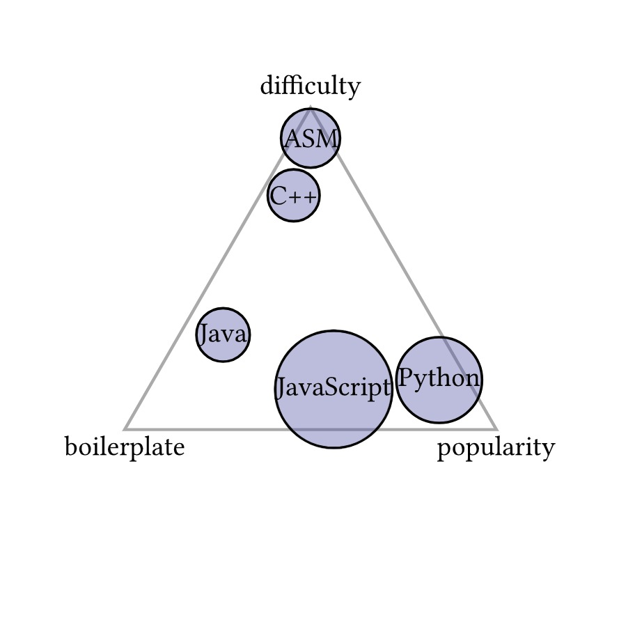
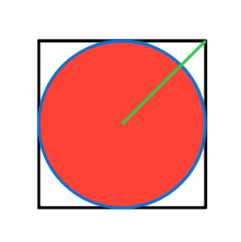
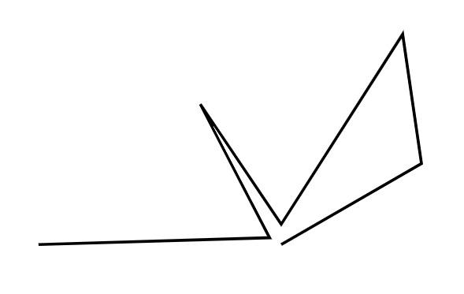
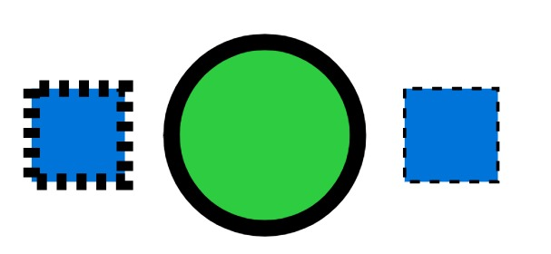

# Typst

Typst is a markup-based typesetting system designed to be an easier, faster, and more intuitive alternative to LaTeX. It combines simplicity, real-time compilation, and flexibility, making it ideal for academic papers, reports, presentations, and technical documents.

## How to install

```bash
Linux: View Typst on Repology
macOS: brew install typst
Windows: winget install --id Typst.Typst
```
## Usage

Once you have installed Typst, you can use it like this:
```sh
# Creates `file.pdf` in working directory.
typst compile file.typ

# Creates PDF file at the desired path.
typst compile path/to/source.typ path/to/output.pdf
```
## Advantages
- **Simpler Syntax**: Compared to LaTeX, Typst uses a more readable and concise syntax.  
- **Real-time Compilation**: Instant preview of changes without the need for complex build processes.  
- **Customizable Templates**: Users can create their own layouts and formatting rules.  
- **Mathematical Typesetting**: Supports equations and mathematical symbols, similar to LaTeX.  
- **Vector Graphics & Diagrams**: Allows integration of charts, graphs, and figures.  


# Typst CeTZ

CeTZ, short for "ein Typst Zeichenpaket," is a drawing library for Typst inspired by LaTeX's TikZ and the Processing programming language. It offers an intuitive API for creating vector graphics directly within Typst documents, facilitating the creation of diagrams, plots, and various visual elements. 

## How to install

To install the CeTZ package under your local typst package dir you can use the install script from the repository.
```sh
just install
```

## Usage
For information, see the [online manual](https://cetz-package.github.io/docs).
The installed version can be imported by prefixing the package name with @local.
```T
#import "@local/cetz:0.3.2"

#cetz.canvas({
  import cetz.draw: *
  // Your drawing code goes here
})
```

## Advantages

#### Intuitive Drawing API
CeTZ provides a user-friendly interface for crafting shapes, lines, and complex figures, making it accessible even to those new to vector graphics.

#### Modular Libraries 
Beyond basic drawing capabilities, CeTZ includes specialized modules:

- **cetz-plot:** Enables the creation of plots and charts.
- **cetz-venn:** Facilitates the drawing of simple two- or three-set Venn diagrams.

#### Integration with Other Packages
CeTZ serves as a foundation for various Typst packages, such as:

- **cirCeTZ:** A port of circuitikz for drawing electrical circuits.
- **fletcher:** Creates commutative diagrams and figures with arrows.
- **riesketcher:** Draws Riemann sums for mathematical illustrations.

## Examples

{width=40%} {width=40%}  
{width=40%} {width=40%}

# CeTZ Plot
***cetz-plot*** is a specialized library within the CeTZ package designed to facilitate the creation of plots and charts in Typst documents. It extends CeTZ's drawing capabilities, enabling users to visualize data effectively.
I can create lists easily:

## How to install

To incorporate cetz-plot into your Typst project, import the package at the beginning of your .typ file:

```t
#import "@preview/cetz-plot:0.1.1"
```
Ensure that the CeTZ package is also imported, as cetz-plot builds upon its functionalities.

## Usage

```t
plot.plot(size: (2,2), x-tick-step: none, y-tick-step: none, {
 plot.add(((0,0), (1,1), (2,.5), (4,3)))
})
```
## Advantages 

- **Data Plotting:** cetz-plot allows for the plotting of various data types, including mathematical functions and empirical datasets.

- **Customization:** Users can tailor plots by adjusting axes, labels, legends, and styles to meet specific presentation needs.

- **Integration:** Seamlessly integrates with Typst and other CeTZ modules, providing a cohesive experience for document preparation.

